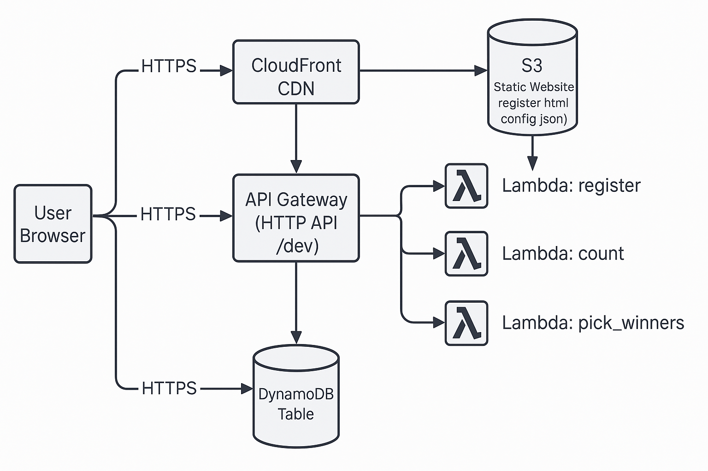
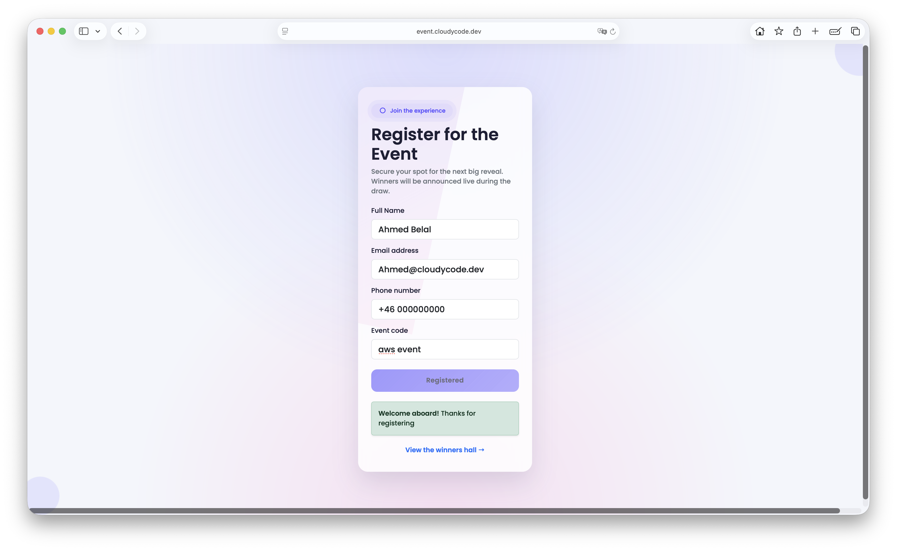
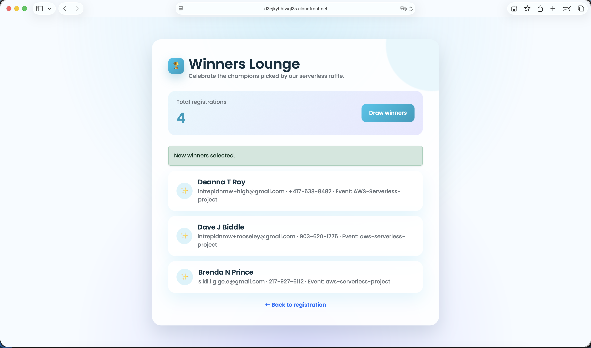
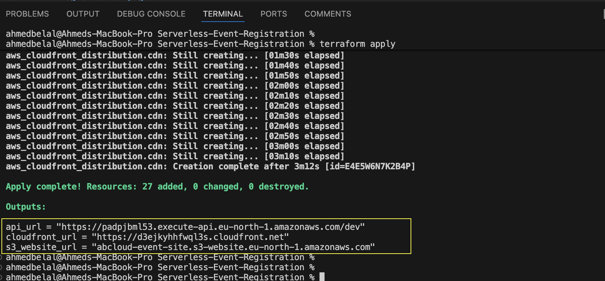

# Serverless Event Registration (Monolithic Stack)

A production-style lab that provisions an end-to-end event registration experience using Terraform:

- **Amazon DynamoDB** stores attendees (partition key `email`, sort key `event`).
- Three **AWS Lambda** functions power registration, counting, and winner selection.
- An **Amazon API Gateway HTTP API** exposes the Lambda endpoints with CORS support.
- An **S3 static website** hosts the stylish registration and winners pages that call the API dynamically.
- An optional **Amazon CloudFront** distribution accelerates and secures the web experience.

**Tech stack:**


This project lives alongside the modular variant in the repo; use it when you want a single `main.tf` that spells out every resource.

---

## 📁 Project Layout

```
Serverless-Event-Registration/
├── README.md
├── main.tf
├── variables.tf
├── terraform.tfvars
├── providers.tf
├── outputs.tf
├── graph.dot
├── images/
│   ├── event-registration-aws-architecture.png
│   ├── register_page.png
│   ├── winner_page.png
│   ├── dynamodb_winner.png
│   └── terraform_apply_result.png
├── lambdas/
│   ├── register.js
│   ├── count.js
│   ├── pick_winners.js
│   ├── register.zip        # auto-generated by terraform plan/apply
│   ├── count.zip           # auto-generated by terraform plan/apply
│   └── pick_winners.zip    # auto-generated by terraform plan/apply
└── web/
    ├── register.html
    └── winners.html
```

`*.zip` archives are created automatically when Terraform packages the Lambda handlers via the `archive_file` data source; feel free to delete them between runs.

---

## 🧭 Architecture At A Glance

1. User submits the registration form served from S3 (or CloudFront).
2. Browser reads `web/config.json` → API base URL.
3. API Gateway (optionally fronted by a custom domain) routes requests to Lambda.
4. Lambda reads/writes from DynamoDB and returns results.
5. Winners page calls `/count` and `/pick_winners` to present live stats.



---

## ✅ Prerequisites

| Requirement | Notes |
| --- | --- |
| Terraform ≥ 1.5 | Installed locally with AWS provider plugins. |
| AWS credentials | IAM user/role with permissions for DynamoDB, Lambda, IAM, API Gateway, S3, CloudFront, ACM, CloudWatch Logs. |
| Node.js 20 runtime in AWS | Lambda runtime uses `nodejs20.x`. |
| **Custom domain (optional)** | If you own a domain, plan to use it for both API Gateway and CloudFront. |
| **ACM certificates** | Required when using custom domains. API Gateway cert must live in your deployment region; CloudFront cert must be in `us-east-1`. |

---

## 🌐 Custom Domain Planning

If you intend to expose the stack on your own domain, prepare these items **before running Terraform**:

1. **API custom domain** (optional)
   - Decide on a hostname, e.g. `api.events.example.com`.
   - Request or import an ACM certificate in the deployment region (default: `eu-north-1`) that covers this hostname.
   - Configure DNS (later) to point the API Gateway domain to the provided target.

2. **Web (S3 + CloudFront) custom domain**
   - Choose the web hostname, e.g. `events.example.com`.
   - Ensure `terraform.tfvars` sets `bucket_name = "events.example.com"` so the S3 website bucket exactly matches the custom domain.
   - Request/import an ACM certificate in **us-east-1** covering the hostname (and `www.` variant if desired). CloudFront requires it.

You will add the ACM ARNs and domain names to Terraform variables in a later step.

---

## ⚙️ Configuration

Open `terraform.tfvars` (or supply your own values) and review:

```hcl
aws_region   = "eu-north-1"
project_name = "abcloud-event"
bucket_name  = "events.example.com"    # MUST match the custom web domain if you are using one
allow_origins = ["*"]
```

To keep the stack lean, Terraform currently relies on the regional/API defaults. When you are ready to wire in custom domains:

1. Set `bucket_name` to the exact hostname you plan to serve (e.g. `events.example.com`).
2. Extend `main.tf` with `aws_apigatewayv2_domain_name` + `aws_apigatewayv2_api_mapping` resources that reference your ACM certificate in the deployment region.
3. Update the CloudFront block to supply the custom domain alias and ACM certificate ARN issued in `us-east-1`.

The README checklist in the next section walks through those additions step by step. Users running the stack with AWS-managed endpoints can skip these extras.

---

## 🚀 Deployment Steps

1. **Clone / open the project**
   ```bash
   git clone https://github.com/engabelal/iac-aws-serverless-event
   cd iac-aws-serverless-event
   ```

2. **Install Terraform providers**
   ```bash
   terraform init
   ```

3. **Review the plan**
   ```bash
   terraform plan
   ```
   Ensure the DynamoDB table, three Lambda functions, API Gateway, S3 bucket, and CloudFront distribution match expectations. Verify that bucket name equals your custom domain when set.

4. **Apply**
   ```bash
   terraform apply -auto-approve
   ```

5. **Update DNS (if using custom domains)**
   - **API Gateway**: After adding the domain resources in Terraform, create an `A` record (alias) pointing `api.events.example.com` to the API Gateway custom domain target shown in the console.
   - **CloudFront/S3**: Create an `A` record (alias) pointing `events.example.com` to the CloudFront distribution domain returned in outputs.

6. **Test**
   - Visit the `cloudfront_url` (or your custom domain) → `register.html`.
   - Submit a registration, confirm the success message.
   - Visit `winners.html` to refresh counts and draw winners. Remember: after three winners are picked, the Lambda locks them in until you reset the table.

---

## 🌐 Custom Domain Implementation Checklist

When you are ready to wire custom domains directly into Terraform, use this outline:

1. **ACM certificates**
   - Request certificates for both the API hostname (regional certificate in your deployment region) and the web hostname (certificate in `us-east-1`).
   - Validate ownership via DNS or email as required by ACM.

2. **Update Terraform**
   - Set `bucket_name` in `terraform.tfvars` to the web hostname (e.g. `events.example.com`).
   - In `main.tf` under the API Gateway section, add `aws_apigatewayv2_domain_name` and `aws_apigatewayv2_api_mapping`, referencing the API certificate ARN.
   - In the CloudFront block, add the `aliases` attribute and specify the us-east-1 certificate ARN inside `viewer_certificate`.
   - Consider parameterising these values if you will toggle between lab and production domains.

3. **Apply & verify**
   - Run `terraform apply` to create the domain associations.
   - Update DNS records (Route 53 or external provider) with alias/ANAME entries for both API and web hostnames.
   - Wait for ACM/CloudFront propagation, then retest the application end-to-end using your branded URLs.

4. **Back to defaults?**
   - Remove or comment out the domain resources and reset `bucket_name` when you need the stack in plain lab mode again.

---

## 📦 Outputs

After `terraform apply`, note the console outputs:

- `api_url` – default API Gateway base URL + stage.
- `s3_website_url` – direct S3 website endpoint.
- `cloudfront_url` – public CDN URL (null if CloudFront disabled).
- Custom domain URLs (if configured) can be derived via the variables you set.

---


## 📸 Result Gallery

- **Registration page** – glassmorphism entry form sourced from S3/CloudFront.

  

- **Winners lounge** – raffle draw locked on three unique winners.

  

- **DynamoDB table scan** – proof of persisted attendees and winner flags.

  

- **Terraform apply output** – CLI logs highlighting the emitted endpoints.

  


---

## 🧼 Clean Up (Important)

When you are done:

```bash
terraform destroy -auto-approve
```

Terraform will delete all infrastructure **except** CloudWatch Log Groups created by Lambda. To avoid surprise charges, delete them manually afterwards:

```bash
aws logs delete-log-group --log-group-name "/aws/lambda/abcloud-event_register"
aws logs delete-log-group --log-group-name "/aws/lambda/abcloud-event_count"
aws logs delete-log-group --log-group-name "/aws/lambda/abcloud-event_pick_winners"
```

Double-check the AWS Console for any additional log groups created by test runs.

---

## 🛠 Troubleshooting Tips

- **AccessDenied on S3 bucket policy**: Ensure the public access block resource is disabled (already handled in Terraform) and that you are not enforcing organization SCPs.
- **CloudFront certificate errors**: ACM certificates for CloudFront must reside in `us-east-1`, even if you deploy the stack elsewhere.
- **API custom domain mismatch**: Bucket name must equal the web custom domain. For API, be sure DNS is pointing to the API Gateway domain after Terraform completes.
- **Winner logic**: If you want a fresh draw, delete or truncate the DynamoDB table entries before running `/pick_winners` again.

---

## 📄 License

This project is released under the MIT License.

```
MIT License

Copyright (c) 2024 Ahmed Belal

Permission is hereby granted, free of charge, to any person obtaining a copy
of this software and associated documentation files (the "Software"), to deal
in the Software without restriction, including without limitation the rights
*** End Patch
