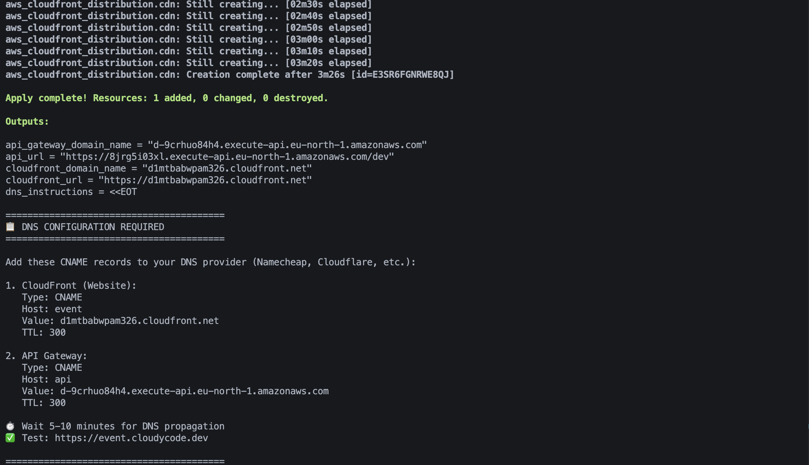

# 🎟️ Serverless Event Registration System

A production-ready serverless event registration and raffle system built with AWS services and Terraform IaC.

## 🏗️ Architecture Overview

```
User → CloudFront → S3 (Static Website) → API Gateway → Lambda → DynamoDB
```

### Components:
- **Frontend**: Static HTML/JS hosted on S3 + CloudFront CDN
- **Backend**: API Gateway HTTP API + Lambda Functions (Node.js 20.x)
- **Database**: DynamoDB (Pay-per-request billing)
- **CDN**: CloudFront distribution with cost-optimized edge locations

**Tech Stack:**


---

## 📋 Features

✅ **Event Registration** - Users submit email/name to register for events  
✅ **Winner Selection** - Admin can pick random winners from participants  
✅ **Count API** - Get total number of registered participants  
✅ **CORS Enabled** - API accessible from any origin  
✅ **Custom Domains** - Support for branded URLs (optional)  
✅ **Auto-deployment** - Terraform handles all infrastructure  

---

## 🚀 Quick Start

### Prerequisites
- AWS CLI configured with credentials
- Terraform >= 1.5
- Node.js 20.x (for Lambda runtime)

### Deployment Steps

```bash
# 1. Clone and navigate to project
cd Serverless-Event-Registration

# 2. Initialize Terraform
terraform init

# 3. Review the plan
terraform plan

# 4. Deploy infrastructure
terraform apply -auto-approve

# 5. Get outputs
terraform output
```

### Outputs
After deployment, you'll get:
- **CloudFront URL**: `https://d1234abcd.cloudfront.net`
- **S3 Website URL**: `http://bucket-name.s3-website.eu-north-1.amazonaws.com`
- **API Gateway URL**: `https://abc123.execute-api.eu-north-1.amazonaws.com/dev`

---

## ⚙️ Configuration

### Variables (`variables.tf`)

| Variable | Default | Description |
|----------|---------|-------------|
| `aws_region` | `eu-north-1` | AWS region for deployment |
| `project_name` | `abcloud-event` | Project name prefix |
| `bucket_name` | `abcloud-event-site` | S3 bucket name (must be globally unique) |
| `allow_origins` | `["*"]` | CORS allowed origins |
| `cloudfront_domain` | `""` | Custom domain for CloudFront (optional) |
| `acm_certificate_arn` | `""` | ACM certificate ARN for CloudFront (us-east-1) |
| `api_domain` | `""` | Custom domain for API Gateway (optional) |
| `api_certificate_arn` | `""` | ACM certificate ARN for API Gateway (regional) |

### Custom Configuration

Create `terraform.tfvars`:
```hcl
aws_region   = "us-east-1"
project_name = "my-event"
bucket_name  = "events.example.com"
allow_origins = ["https://example.com"]

# Optional: Custom domains
cloudfront_domain = "events.example.com"
acm_certificate_arn = "arn:aws:acm:us-east-1:123456789012:certificate/abc-123"
api_domain = "api.events.example.com"
api_certificate_arn = "arn:aws:acm:eu-north-1:123456789012:certificate/xyz-789"
```

---

## 🌐 CloudFront Configuration

### Price Classes Explained

```hcl
price_class = "PriceClass_100"
```

**AWS CloudFront Price Classes:**

| Price Class | Coverage | Cost | Use Case |
|-------------|----------|------|----------|
| `PriceClass_100` | US, Canada, Europe | 💰 Cheapest | Regional apps, cost-sensitive projects |
| `PriceClass_200` | + Asia, Middle East, Africa | 💰💰 Medium | Multi-regional apps |
| `PriceClass_All` | All edge locations worldwide | 💰💰💰 Highest | Global apps requiring lowest latency everywhere |

**Current Setup**: `PriceClass_100` - Most cost-effective for European/North American users.

### Cache Policy

```hcl
cache_policy_id = "658327ea-f89d-4fab-a63d-7e88639e58f6"  # CachingOptimized
```

**AWS Managed Cache Policies:**

Get full list with CLI:
```bash
aws cloudfront list-cache-policies --type managed
```

| Policy | ID | Use Case |
|--------|-----|----------|
| `CachingDisabled` | `4135ea2d-6df8-44a3-9df3-4b5a84be39ad` | Dynamic content, no caching |
| `CachingOptimized` | `658327ea-f89d-4fab-a63d-7e88639e58f6` | ✅ Recommended for most use cases |
| `CachingOptimizedForUncompressedObjects` | `b2884449-e4de-46a7-ac36-70bc7f1ddd6d` | Large files, videos |

**Current Setup**: Using `CachingOptimized` - Best performance for static websites.

---

## 🔒 SSL/TLS Certificate Setup

### Option 1: CloudFront Default Certificate (Current)
```hcl
viewer_certificate {
  cloudfront_default_certificate = true
}
```
- ✅ Free, automatic
- ✅ Works immediately
- ❌ Uses CloudFront domain: `d1234abcd.cloudfront.net`
- ❌ No custom domain

### Option 2: Custom Domain with ACM Certificate

#### Step-by-Step Setup:

**1. Request CloudFront Certificate in ACM (us-east-1 ONLY)**
```bash
# CloudFront requires certificates in us-east-1 region!
aws acm request-certificate \
  --domain-name events.example.com \
  --subject-alternative-names "www.events.example.com" \
  --validation-method DNS \
  --region us-east-1
```

**2. Request API Gateway Certificate (Regional)**
```bash
# API Gateway certificate in your deployment region
aws acm request-certificate \
  --domain-name api.events.example.com \
  --validation-method DNS \
  --region eu-north-1
```

**3. Validate Certificates**
- Go to ACM Console → Certificate → Create DNS records in Route53
- Or manually add CNAME records to your DNS provider
- Wait for status to change to "Issued"

**4. Update Terraform Configuration**
```hcl
# terraform.tfvars
cloudfront_domain = "events.example.com"
acm_certificate_arn = "arn:aws:acm:us-east-1:123456789012:certificate/abc-123-def"
api_domain = "api.events.example.com"
api_certificate_arn = "arn:aws:acm:eu-north-1:123456789012:certificate/xyz-789-ghi"
bucket_name = "events.example.com"  # Must match CloudFront domain
```

**5. Create Route53 DNS Records**
```hcl
# Add to main.tf or separate dns.tf file
data "aws_route53_zone" "main" {
  name = "example.com"
}

# CloudFront A record
resource "aws_route53_record" "cloudfront" {
  zone_id = data.aws_route53_zone.main.zone_id
  name    = "events.example.com"
  type    = "A"
  
  alias {
    name                   = aws_cloudfront_distribution.cdn.domain_name
    zone_id                = aws_cloudfront_distribution.cdn.hosted_zone_id
    evaluate_target_health = false
  }
}

# CloudFront AAAA record (IPv6)
resource "aws_route53_record" "cloudfront_ipv6" {
  zone_id = data.aws_route53_zone.main.zone_id
  name    = "events.example.com"
  type    = "AAAA"
  
  alias {
    name                   = aws_cloudfront_distribution.cdn.domain_name
    zone_id                = aws_cloudfront_distribution.cdn.hosted_zone_id
    evaluate_target_health = false
  }
}

# API Gateway A record
resource "aws_route53_record" "api" {
  count   = var.api_certificate_arn != "" ? 1 : 0
  zone_id = data.aws_route53_zone.main.zone_id
  name    = "api.events.example.com"
  type    = "A"
  
  alias {
    name                   = aws_apigatewayv2_domain_name.api[0].domain_name_configuration[0].target_domain_name
    zone_id                = aws_apigatewayv2_domain_name.api[0].domain_name_configuration[0].hosted_zone_id
    evaluate_target_health = false
  }
}
```

---

## 🌍 Real-World Example: Production Setup

### Scenario: Company Event Registration for Global Audience

**1. Prepare ACM Certificates**
```bash
# CloudFront certificate (us-east-1)
aws acm request-certificate \
  --domain-name events.company.com \
  --validation-method DNS \
  --region us-east-1

# API Gateway certificate (deployment region)
aws acm request-certificate \
  --domain-name api.events.company.com \
  --validation-method DNS \
  --region eu-north-1
```

**2. Configure terraform.tfvars**
```hcl
aws_region   = "eu-north-1"
project_name = "company-events-2024"
bucket_name  = "events.company.com"

# Custom domains
cloudfront_domain = "events.company.com"
acm_certificate_arn = "arn:aws:acm:us-east-1:987654321098:certificate/abc-123-def"
api_domain = "api.events.company.com"
api_certificate_arn = "arn:aws:acm:eu-north-1:987654321098:certificate/xyz-789-ghi"

# CORS - restrict to company domains
allow_origins = [
  "https://company.com",
  "https://www.company.com",
  "https://events.company.com"
]
```

**3. Update main.tf for Production**
```hcl
resource "aws_cloudfront_distribution" "cdn" {
  enabled             = true
  default_root_object = "register.html"
  aliases             = var.acm_certificate_arn != "" ? [var.cloudfront_domain] : []
  price_class         = "PriceClass_200"  # Global audience needs Asia/Middle East

  origin {
    domain_name = aws_s3_bucket_website_configuration.site.website_endpoint
    origin_id   = "s3-website-${aws_s3_bucket.site.bucket}"
    custom_origin_config {
      http_port              = 80
      https_port             = 443
      origin_protocol_policy = "http-only"
      origin_ssl_protocols   = ["TLSv1.2"]
    }
  }

  default_cache_behavior {
    target_origin_id       = "s3-website-${aws_s3_bucket.site.bucket}"
    viewer_protocol_policy = "redirect-to-https"
    allowed_methods        = ["GET", "HEAD"]
    cached_methods         = ["GET", "HEAD"]
    cache_policy_id        = "658327ea-f89d-4fab-a63d-7e88639e58f6"  # CachingOptimized
  }

  restrictions {
    geo_restriction {
      restriction_type = "none"
      # Optional: Restrict to specific countries
      # restriction_type = "whitelist"
      # locations        = ["US", "CA", "GB", "DE", "FR"]
    }
  }

  viewer_certificate {
    acm_certificate_arn      = var.acm_certificate_arn
    ssl_support_method       = "sni-only"
    minimum_protocol_version = "TLSv1.2_2021"
  }

  tags = {
    Environment = "production"
    Project     = var.project_name
  }
}
```

**4. Deploy and Configure DNS**
```bash
# Deploy infrastructure
terraform apply -auto-approve

# DNS records are created automatically by Terraform
# Verify in Route53 console or with:
aws route53 list-resource-record-sets --hosted-zone-id Z1234567890ABC
```

**5. Test Production URLs**
```bash
# Test website
curl -I https://events.company.com

# Test API
curl https://api.events.company.com/count
```

---

## 📡 API Endpoints

### Base URL
```
https://{api-id}.execute-api.{region}.amazonaws.com/dev
# Or with custom domain:
https://api.events.example.com
```

### Endpoints

#### 1. Register for Event
```bash
POST /register
Content-Type: application/json

{
  "email": "user@example.com",
  "name": "John Doe",
  "event": "Tech Conference 2024"
}

# Response:
{
  "message": "Registration successful!",
  "email": "user@example.com"
}
```

#### 2. Get Participant Count
```bash
GET /count

# Response:
{
  "count": 156
}
```

#### 3. Pick Winners
```bash
GET /pick_winners

# Response:
{
  "winners": [
    {
      "email": "winner1@example.com",
      "name": "Lucky Person 1",
      "event": "Tech Conference 2024"
    },
    {
      "email": "winner2@example.com",
      "name": "Lucky Person 2",
      "event": "Tech Conference 2024"
    },
    {
      "email": "winner3@example.com",
      "name": "Lucky Person 3",
      "event": "Tech Conference 2024"
    }
  ]
}
```

---

## 🗂️ Project Structure

```
Serverless-Event-Registration/
├── main.tf                 # Main infrastructure code
├── variables.tf            # Input variables
├── outputs.tf              # Output values
├── providers.tf            # AWS provider config
├── terraform.tfvars        # Variable values (gitignored)
├── images/
│   ├── event-registration-aws-architecture.png
│   ├── register_page.png
│   ├── winner_page.png
│   ├── dynamodb_winner.png
│   └── terraform_apply_result.png
├── lambdas/
│   ├── register.js         # Registration Lambda
│   ├── count.js            # Count Lambda
│   ├── pick_winners.js     # Winner selection Lambda
│   ├── register.zip        # Auto-generated
│   ├── count.zip           # Auto-generated
│   └── pick_winners.zip    # Auto-generated
└── web/
    ├── register.html       # Registration page
    ├── winners.html        # Winners page
    └── config.json         # Auto-generated API config
```

---

## 📸 Screenshots

### Registration Page


### Winners Page


### DynamoDB Table


### Terraform Apply Result


---

## 🔧 Useful Commands

### Get CloudFront Cache Policies
```bash
aws cloudfront list-cache-policies --type managed \
  --query 'CachePolicyList.Items[*].[Name,Id]' \
  --output table
```

### Invalidate CloudFront Cache
```bash
# Get distribution ID from Terraform output
DIST_ID=$(terraform output -raw cloudfront_distribution_id)

# Invalidate all files
aws cloudfront create-invalidation \
  --distribution-id $DIST_ID \
  --paths "/*"
```

### Check Certificate Status
```bash
# CloudFront certificate (us-east-1)
aws acm describe-certificate \
  --certificate-arn arn:aws:acm:us-east-1:123456789012:certificate/abc-123 \
  --region us-east-1

# API Gateway certificate (regional)
aws acm describe-certificate \
  --certificate-arn arn:aws:acm:eu-north-1:123456789012:certificate/xyz-789 \
  --region eu-north-1
```

### Test API Endpoints
```bash
# Get API URL
API_URL=$(terraform output -raw api_url)

# Test count
curl $API_URL/count

# Test registration
curl -X POST $API_URL/register \
  -H "Content-Type: application/json" \
  -d '{
    "email":"test@example.com",
    "name":"Test User",
    "event":"Tech Conference 2024"
  }'

# Test pick winners
curl $API_URL/pick_winners
```

### View Lambda Logs
```bash
# Get log group name
aws logs describe-log-groups \
  --log-group-name-prefix "/aws/lambda/abcloud-event"

# Tail logs
aws logs tail /aws/lambda/abcloud-event_register --follow
```

---

## 💰 Cost Estimation

### Monthly Costs (Approximate)

| Service | Usage | Cost |
|---------|-------|------|
| **DynamoDB** | Pay-per-request, 10K requests | ~$2.50 |
| **Lambda** | 1M requests, 128MB, 1s avg | ~$0.20 |
| **API Gateway** | 1M requests | ~$1.00 |
| **S3** | 1GB storage, 10K requests | ~$0.05 |
| **CloudFront** | 10GB transfer (PriceClass_100) | ~$0.85 |
| **Route53** | 1 hosted zone (if used) | ~$0.50 |
| **ACM Certificate** | SSL/TLS certificates | **FREE** |
| **CloudWatch Logs** | 1GB logs | ~$0.50 |

**Total**: ~$5.60/month (with custom domain) or ~$5.10/month (without Route53)

---

## 🛡️ Security Best Practices

### Current Setup
✅ HTTPS enforced via CloudFront  
✅ S3 bucket policy restricts to GetObject only  
✅ Lambda IAM roles with least privilege  
✅ API Gateway CORS configured  
✅ TLS 1.2+ enforced on all endpoints  

### Production Recommendations
- [ ] Enable CloudFront WAF for DDoS protection
- [ ] Implement API Gateway throttling/rate limiting
- [ ] Add Lambda environment variable encryption (KMS)
- [ ] Enable CloudTrail for audit logging
- [ ] Restrict CORS to specific domains (not `*`)
- [ ] Add DynamoDB point-in-time recovery
- [ ] Implement API authentication (Cognito/API Keys)
- [ ] Enable S3 bucket versioning
- [ ] Add CloudWatch alarms for Lambda errors
- [ ] Implement request validation in API Gateway

---

## 🧹 Cleanup

```bash
# Destroy all resources
terraform destroy -auto-approve

# Manually delete CloudWatch Log Groups (not managed by Terraform)
aws logs delete-log-group --log-group-name "/aws/lambda/abcloud-event_register"
aws logs delete-log-group --log-group-name "/aws/lambda/abcloud-event_count"
aws logs delete-log-group --log-group-name "/aws/lambda/abcloud-event_pick_winners"

# If S3 bucket has objects, empty it first
aws s3 rm s3://your-bucket-name --recursive
```

---

## 🛠️ Troubleshooting

### Common Issues

**1. S3 Bucket Policy Error**
```
Error: AccessDenied: Access Denied
```
- Ensure public access block is disabled
- Check bucket policy allows GetObject
- Verify no organization SCPs blocking public access

**2. CloudFront Certificate Error**
```
Error: InvalidViewerCertificate
```
- Certificate MUST be in us-east-1 region
- Certificate must cover the domain in aliases
- Wait for certificate validation to complete

**3. API Gateway Custom Domain Error**
```
Error: BadRequestException: The certificate must be in the same region
```
- API Gateway certificate must be in deployment region
- CloudFront certificate must be in us-east-1
- Don't mix them up!

**4. CORS Error in Browser**
```
Access to fetch at 'https://api...' has been blocked by CORS policy
```
- Check `allow_origins` in terraform.tfvars
- Verify API Gateway CORS configuration
- Clear browser cache and retry

**5. Winner Selection Not Working**
```
Winners already selected
```
- Lambda locks winners after first selection
- Delete DynamoDB items or reset winner flags
- Or deploy fresh stack for new event

---

## 📚 Additional Resources

- [AWS CloudFront Pricing](https://aws.amazon.com/cloudfront/pricing/)
- [ACM Certificate Validation](https://docs.aws.amazon.com/acm/latest/userguide/dns-validation.html)
- [CloudFront Cache Policies](https://docs.aws.amazon.com/AmazonCloudFront/latest/DeveloperGuide/using-managed-cache-policies.html)
- [API Gateway Custom Domains](https://docs.aws.amazon.com/apigateway/latest/developerguide/how-to-custom-domains.html)
- [DynamoDB Best Practices](https://docs.aws.amazon.com/amazondynamodb/latest/developerguide/best-practices.html)
- [Lambda Best Practices](https://docs.aws.amazon.com/lambda/latest/dg/best-practices.html)
- [Terraform AWS Provider Docs](https://registry.terraform.io/providers/hashicorp/aws/latest/docs)

---

## 📝 License

MIT License - Copyright (c) 2024 Ahmed Belal

---

## 👨‍💻 Author

**Ahmed Belal - DevOps Engineer**  
- GitHub: [@engabelal](https://github.com/engabelal)
- LinkedIn: [Ahmed Belal](https://linkedin.com/in/engabelal)

---

## 🎯 Next Steps

1. ✅ Deploy basic infrastructure
2. ✅ Add CloudFront with optimized caching
3. ⬜ Add custom domain with ACM certificates
4. ⬜ Implement user authentication (Cognito)
5. ⬜ Add email notifications (SES)
6. ⬜ Create admin dashboard
7. ⬜ Add analytics (CloudWatch/Athena)
8. ⬜ Implement CI/CD pipeline (GitHub Actions)
9. ⬜ Add monitoring and alerting
10. ⬜ Implement backup and disaster recovery

---

**Happy Event Registration! 🎉**
