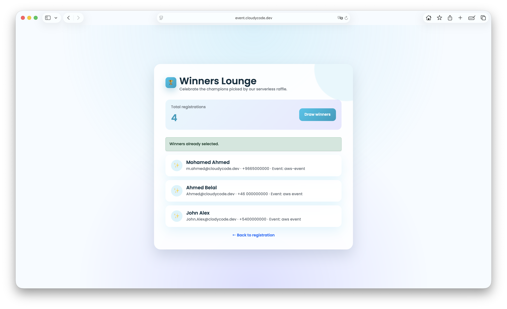
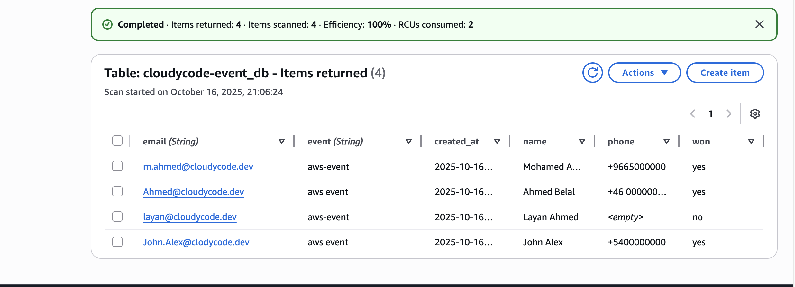

# 🎟️ Serverless Event Registration System

Production-ready serverless event registration and raffle system built with AWS and Terraform.

---

## 📸 Live Demo & Results

### 🌐 Production URLs
- **Website**: https://event.cloudycode.dev
- **API**: https://api.cloudycode.dev

### Screenshots

<table>
  <tr>
    <td><br/><b>Registration Page</b></td>
    <td><br/><b>Winners Page</b></td>
  </tr>
  <tr>
    <td><br/><b>DynamoDB Table</b></td>
    <td><br/><b>AWS Architecture</b></td>
  </tr>
</table>

---

## 🛠️ Tech Stack

### Infrastructure & DevOps


### AWS Services


### Frontend & Backend


---

## 📐 Architecture

```
User → Route53 → CloudFront CDN → S3 Static Website → API Gateway → Lambda → DynamoDB
                      ↓
                  ACM (SSL/TLS)
```

**Flow:**
1. User accesses `event.cloudycode.dev` (Route53 → CloudFront)
2. CloudFront serves static files from S3
3. Frontend calls `api.cloudycode.dev` (API Gateway)
4. API Gateway triggers Lambda functions
5. Lambda reads/writes to DynamoDB

---

## ✨ Features

- ✅ Event registration with email/name validation
- ✅ Random winner selection (3 winners max)
- ✅ Real-time participant count
- ✅ Custom domain with SSL/TLS (ACM)
- ✅ Global CDN distribution (CloudFront)
- ✅ CORS enabled for cross-origin requests
- ✅ Infrastructure as Code (Terraform)
- ✅ Serverless architecture (pay-per-use)

---

## 🚀 Quick Start

### Prerequisites
```bash
# Required
- AWS CLI configured with credentials
- Terraform >= 1.5
- Node.js 20.x
```

### Deploy in 3 Steps

```bash
# 1. Initialize Terraform
terraform init

# 2. Review changes
terraform plan

# 3. Deploy
terraform apply -auto-approve
```

### Get Your URLs
```bash
terraform output
```

**Output:**
```
api_url         = "https://abc123.execute-api.eu-north-1.amazonaws.com/dev"
s3_website_url  = "http://event.cloudycode.dev.s3-website.eu-north-1.amazonaws.com"
cloudfront_url  = "https://d1234abcd.cloudfront.net"
```

---

## ⚙️ Configuration

### Basic Setup (No Custom Domain)

**terraform.tfvars:**
```hcl
aws_region    = "eu-north-1"
project_name  = "my-event"
bucket_name   = "my-event-site-12345"
allow_origins = ["*"]
```

### Production Setup (With Custom Domain)

**terraform.tfvars:**
```hcl
aws_region    = "eu-north-1"
project_name  = "cloudycode-event"
bucket_name   = "event.cloudycode.dev"  # Must match domain

# Custom domains
cloudfront_domain = "event.cloudycode.dev"
api_domain        = "api.cloudycode.dev"

# ACM certificates (add after creating them)
acm_certificate_arn = "arn:aws:acm:us-east-1:123456789012:certificate/abc-123"
api_certificate_arn = "arn:aws:acm:eu-north-1:123456789012:certificate/xyz-789"

# CORS
allow_origins = ["https://event.cloudycode.dev"]
```

---

## 🌐 CloudFront Configuration

### Price Classes

| Class | Coverage | Cost | Use Case |
|-------|----------|------|----------|
| `PriceClass_100` ✅ | US, Canada, Europe | 💰 Cheapest | Regional apps |
| `PriceClass_200` | + Asia, Middle East | 💰💰 Medium | Multi-regional |
| `PriceClass_All` | All edge locations | 💰💰💰 Highest | Global apps |

**Current:** `PriceClass_100` (most cost-effective)

### Cache Policy

```hcl
cache_policy_id = "658327ea-f89d-4fab-a63d-7e88639e58f6"  # CachingOptimized
```

**AWS Managed Policies:**
1. `CachingDisabled` - No caching
2. `CachingOptimized` ✅ - Recommended
3. `CachingOptimizedForUncompressedObjects` - Large files

**Get list:**
```bash
aws cloudfront list-cache-policies --type managed
```

---

## 🔒 SSL/TLS Certificates Setup

### Certificate Requirements

| Service | Region | Domain Example |
|---------|--------|----------------|
| **CloudFront** | **us-east-1** ⚠️ | event.cloudycode.dev |
| **API Gateway** | Deployment region | api.cloudycode.dev |

### Step-by-Step

**1. Request Certificates**
```bash
# CloudFront (MUST be us-east-1)
aws acm request-certificate \
  --domain-name event.cloudycode.dev \
  --validation-method DNS \
  --region us-east-1

# API Gateway (deployment region)
aws acm request-certificate \
  --domain-name api.cloudycode.dev \
  --validation-method DNS \
  --region eu-north-1
```

**2. Validate via DNS**
- Go to ACM Console → Certificate
- Create DNS records in Route53 (or your DNS provider)
- Wait for status: "Issued" ✅

**3. Update terraform.tfvars**
```hcl
acm_certificate_arn = "arn:aws:acm:us-east-1:123456789012:certificate/abc-123"
api_certificate_arn = "arn:aws:acm:eu-north-1:123456789012:certificate/xyz-789"
```

**4. Deploy**
```bash
terraform apply -auto-approve
```

---

## 🌍 Real Production Example: cloudycode.dev

### Actual Configuration Used

**Domain Structure:**
```
Website:  event.cloudycode.dev  → CloudFront → S3
API:      api.cloudycode.dev    → API Gateway → Lambda → DynamoDB
```

**terraform.tfvars:**
```hcl
aws_region    = "eu-north-1"
project_name  = "cloudycode-event"
bucket_name   = "event.cloudycode.dev"

cloudfront_domain = "event.cloudycode.dev"
api_domain        = "api.cloudycode.dev"

acm_certificate_arn = "arn:aws:acm:us-east-1:123456789012:certificate/abc-123"
api_certificate_arn = "arn:aws:acm:eu-north-1:123456789012:certificate/xyz-789"

allow_origins = ["https://event.cloudycode.dev"]
```

### DNS Configuration (Route53)

**Add to your Terraform or create manually:**
```hcl
data "aws_route53_zone" "main" {
  name = "cloudycode.dev"
}

# CloudFront A record (IPv4)
resource "aws_route53_record" "cloudfront" {
  zone_id = data.aws_route53_zone.main.zone_id
  name    = "event.cloudycode.dev"
  type    = "A"
  
  alias {
    name                   = aws_cloudfront_distribution.cdn.domain_name
    zone_id                = aws_cloudfront_distribution.cdn.hosted_zone_id
    evaluate_target_health = false
  }
}

# CloudFront AAAA record (IPv6)
resource "aws_route53_record" "cloudfront_ipv6" {
  zone_id = data.aws_route53_zone.main.zone_id
  name    = "event.cloudycode.dev"
  type    = "AAAA"
  
  alias {
    name                   = aws_cloudfront_distribution.cdn.domain_name
    zone_id                = aws_cloudfront_distribution.cdn.hosted_zone_id
    evaluate_target_health = false
  }
}

# API Gateway A record
resource "aws_route53_record" "api" {
  zone_id = data.aws_route53_zone.main.zone_id
  name    = "api.cloudycode.dev"
  type    = "A"
  
  alias {
    name                   = aws_apigatewayv2_domain_name.api[0].domain_name_configuration[0].target_domain_name
    zone_id                = aws_apigatewayv2_domain_name.api[0].domain_name_configuration[0].hosted_zone_id
    evaluate_target_health = false
  }
}
```

### Testing
```bash
# Website
curl -I https://event.cloudycode.dev

# API
curl https://api.cloudycode.dev/count
```

---

## 📡 API Endpoints

**Base URL:** `https://api.cloudycode.dev`

### 1. Register for Event
```bash
POST /register
Content-Type: application/json

{
  "email": "user@example.com",
  "name": "John Doe",
  "event": "Tech Conference 2024"
}
```

**Response:**
```json
{
  "message": "Registration successful!",
  "email": "user@example.com"
}
```

### 2. Get Participant Count
```bash
GET /count
```

**Response:**
```json
{
  "count": 156
}
```

### 3. Pick Winners
```bash
GET /pick_winners
```

**Response:**
```json
{
  "winners": [
    {"email": "winner1@example.com", "name": "Person 1"},
    {"email": "winner2@example.com", "name": "Person 2"},
    {"email": "winner3@example.com", "name": "Person 3"}
  ]
}
```

---

## 📁 Project Structure

```
Serverless-Event-Registration/
├── main.tf                 # Infrastructure code
├── variables.tf            # Input variables
├── outputs.tf              # Output values
├── providers.tf            # AWS provider
├── terraform.tfvars        # Configuration
├── images/                 # Screenshots
├── lambdas/
│   ├── register.js
│   ├── count.js
│   └── pick_winners.js
└── web/
    ├── register.html
    └── winners.html
```

---

## 🔧 Useful Commands

### CloudFront
```bash
# List cache policies
aws cloudfront list-cache-policies --type managed

# Invalidate cache
aws cloudfront create-invalidation \
  --distribution-id E1234ABCD \
  --paths "/*"
```

### ACM Certificates
```bash
# Check CloudFront cert (us-east-1)
aws acm describe-certificate \
  --certificate-arn arn:aws:acm:us-east-1:123456789012:certificate/abc-123 \
  --region us-east-1

# Check API cert (regional)
aws acm describe-certificate \
  --certificate-arn arn:aws:acm:eu-north-1:123456789012:certificate/xyz-789 \
  --region eu-north-1
```

### Testing API
```bash
API_URL=$(terraform output -raw api_url)

# Count
curl $API_URL/count

# Register
curl -X POST $API_URL/register \
  -H "Content-Type: application/json" \
  -d '{"email":"test@example.com","name":"Test","event":"Conference"}'

# Pick winners
curl $API_URL/pick_winners
```

### Lambda Logs
```bash
aws logs tail /aws/lambda/cloudycode-event_register --follow
aws logs tail /aws/lambda/cloudycode-event_count --follow
aws logs tail /aws/lambda/cloudycode-event_pick_winners --follow
```

---

## 💰 Cost Estimation

| Service | Usage | Monthly Cost |
|---------|-------|--------------|
| DynamoDB | 10K requests | ~$2.50 |
| Lambda | 1M requests | ~$0.20 |
| API Gateway | 1M requests | ~$1.00 |
| S3 | 1GB + 10K requests | ~$0.05 |
| CloudFront | 10GB (PriceClass_100) | ~$0.85 |
| Route53 | 1 hosted zone | ~$0.50 |
| ACM | SSL certificates | **FREE** |
| CloudWatch | 1GB logs | ~$0.50 |

**Total:** ~$5.60/month

---

## 🛡️ Security Best Practices

### ✅ Implemented
- HTTPS enforced (CloudFront + API Gateway)
- S3 bucket policy (GetObject only)
- Lambda IAM least privilege
- CORS configured
- TLS 1.2+ enforced

### 📋 Production Recommendations
- [ ] CloudFront WAF for DDoS protection
- [ ] API Gateway throttling/rate limiting
- [ ] Lambda environment encryption (KMS)
- [ ] CloudTrail audit logging
- [ ] Restrict CORS to specific domains
- [ ] DynamoDB point-in-time recovery
- [ ] API authentication (Cognito/API Keys)
- [ ] CloudWatch alarms for errors

---

## 🧹 Cleanup

```bash
# Destroy all infrastructure
terraform destroy -auto-approve

# Delete Lambda logs (not managed by Terraform)
aws logs delete-log-group --log-group-name "/aws/lambda/cloudycode-event_register"
aws logs delete-log-group --log-group-name "/aws/lambda/cloudycode-event_count"
aws logs delete-log-group --log-group-name "/aws/lambda/cloudycode-event_pick_winners"

# Empty S3 bucket if needed
aws s3 rm s3://event.cloudycode.dev --recursive
```

### ⚠️ Important: Redeploying the Project

If you destroy and want to redeploy:

**1. Delete DNS Records First**
- Go to your DNS provider (Namecheap, Cloudflare, etc.)
- Delete A/AAAA records for `event.cloudycode.dev` and `api.cloudycode.dev`
- **Wait 5-10 minutes** for DNS propagation

**2. Verify DNS is Cleared**
```bash
nslookup event.cloudycode.dev
# Should return "can't find" or no result ✅
```

**3. Then Redeploy**
```bash
terraform apply -auto-approve
```

**Why?** CloudFront caches DNS records. If old records exist pointing to deleted distributions, you'll get:
```
Error: CNAMEAlreadyExists
```

**Quick Fix if Error Occurs:**
- Delete DNS records from your provider
- Wait 5-10 minutes
- Retry `terraform apply`

---

## 🛠️ Troubleshooting

### S3 Access Denied
**Problem:** Can't access S3 website  
**Solution:**
- Check public access block is disabled
- Verify bucket policy allows GetObject
- Check organization SCPs

### CloudFront Certificate Error
**Problem:** Certificate validation failed  
**Solution:**
- Certificate MUST be in us-east-1 ⚠️
- Certificate must cover domain in aliases
- Wait for DNS validation to complete

### API Gateway Certificate Error
**Problem:** Certificate region mismatch  
**Solution:**
- API cert must be in deployment region
- CloudFront cert must be in us-east-1
- Don't mix them up!

### CORS Error
**Problem:** Browser blocks API requests  
**Solution:**
- Check `allow_origins` in terraform.tfvars
- Verify API Gateway CORS configuration
- Clear browser cache

### Winners Already Selected
**Problem:** Can't pick new winners  
**Solution:**
- Lambda locks winners after first draw
- Delete DynamoDB items to reset
- Or deploy fresh stack for new event

---

## 🖱️ Manual Deployment (AWS Console)

If you prefer using AWS Console instead of Terraform:

### 1. ACM Certificates
**Region: us-east-1 (for CloudFront)**
- Go to ACM Console → Request certificate
- Domain: `*.cloudycode.dev`
- Validation: DNS
- Add CNAME records to Route53

**Region: eu-north-1 (for API Gateway)**
- Repeat above steps in eu-north-1

### 2. DynamoDB Table
- Service: DynamoDB → Create table
- Name: `cloudycode-event_db`
- Partition key: `email` (String)
- Sort key: `event` (String)
- Billing: On-demand

### 3. IAM Role for Lambda
- Service: IAM → Roles → Create role
- Trusted entity: Lambda
- Permissions: `AmazonDynamoDBFullAccess`, `CloudWatchLogsFullAccess`
- Name: `cloudycode-event-lambda-role`

### 4. Lambda Functions (Create 3)
**Function 1: Register**
- Runtime: Node.js 20.x
- Role: Use role from step 3
- Code: Upload `lambdas/register.js`
- Environment variable: `TABLE_NAME=cloudycode-event_db`

**Function 2: Count**
- Same as above, upload `lambdas/count.js`

**Function 3: Pick Winners**
- Same as above, upload `lambdas/pick_winners.js`

### 5. API Gateway
- Service: API Gateway → Create HTTP API
- Name: `cloudycode-event-api`
- CORS: Enable, Origins: `https://event.cloudycode.dev`

**Create Routes:**
- `POST /register` → Lambda: register
- `GET /count` → Lambda: count
- `GET /pick_winners` → Lambda: pick_winners

**Create Stage:**
- Name: `dev`
- Auto-deploy: Enable

**Custom Domain (Optional):**
- Domain: `api.cloudycode.dev`
- Certificate: Select from ACM (eu-north-1)
- API mapping: Stage `dev`

### 6. S3 Bucket
- Service: S3 → Create bucket
- Name: `event.cloudycode.dev`
- Region: eu-north-1
- Uncheck "Block all public access"

**Enable Static Website:**
- Properties → Static website hosting
- Index document: `register.html`

**Bucket Policy:**
```json
{
  "Version": "2012-10-17",
  "Statement": [{
    "Sid": "PublicRead",
    "Effect": "Allow",
    "Principal": "*",
    "Action": "s3:GetObject",
    "Resource": "arn:aws:s3:::event.cloudycode.dev/*"
  }]
}
```

**Upload Files:**
- Upload `web/register.html`
- Upload `web/winners.html`
- Create `config.json` with API URL:
```json
{"api_url": "https://api.cloudycode.dev"}
```

### 7. CloudFront Distribution
- Service: CloudFront → Create distribution
- Origin domain: `event.cloudycode.dev.s3-website.eu-north-1.amazonaws.com`
- Origin protocol: HTTP only
- Viewer protocol: Redirect HTTP to HTTPS
- Cache policy: CachingOptimized
- Price class: Use only North America and Europe
- Alternate domain: `event.cloudycode.dev`
- Certificate: Select from ACM (us-east-1)
- Default root object: `register.html`

### 8. Route53 DNS Records
**CloudFront A Record:**
- Type: A
- Name: `event.cloudycode.dev`
- Alias: Yes → CloudFront distribution

**CloudFront AAAA Record:**
- Type: AAAA
- Name: `event.cloudycode.dev`
- Alias: Yes → CloudFront distribution

**API Gateway A Record:**
- Type: A
- Name: `api.cloudycode.dev`
- Alias: Yes → API Gateway domain

### 9. Test
- Visit: `https://event.cloudycode.dev`
- Register a user
- Check DynamoDB table
- Visit winners page

**Total Time:** ~45-60 minutes

---

## 📚 Resources

- [AWS CloudFront Pricing](https://aws.amazon.com/cloudfront/pricing/)
- [ACM Certificate Validation](https://docs.aws.amazon.com/acm/latest/userguide/dns-validation.html)
- [CloudFront Cache Policies](https://docs.aws.amazon.com/AmazonCloudFront/latest/DeveloperGuide/using-managed-cache-policies.html)
- [API Gateway Custom Domains](https://docs.aws.amazon.com/apigateway/latest/developerguide/how-to-custom-domains.html)
- [Terraform AWS Provider](https://registry.terraform.io/providers/hashicorp/aws/latest/docs)

---

## 👨‍💻 Author

**Ahmed Belal** - Cloud and DevOps Engineer  
GitHub: [@engabelal](https://github.com/engabelal)

---

## 📝 License

MIT License - Copyright (c) 2024 Ahmed Belal

---

**🎉 Happy Event Registration!**
